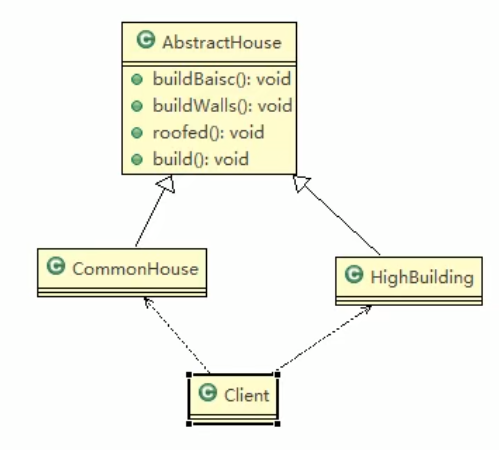

# 盖房项目

## 需求

盖房项目需求：

1) 需要建房子：这一过程为打桩、砌墙、封顶。
2) 房子有各种各样的，比如普通房，高楼，别墅，各种房子的过程虽然一样，但是要求不要相同的。
3) 请编写程序，完成需求。

## 类图

## 问题分析

1) 优点是比较好理解，简单易操作。
2) 设计的程序结构，过于简单，没有设计缓存层对象，程序的扩展和维护不好。也就是说，这种设计方案，把产品(即：房子) 和 创建产品的过程(即：建房子流程) 封装在一起，耦合性增强了。
3) 解决方案：将产品和产品建造过程解耦 => 建造者模式。