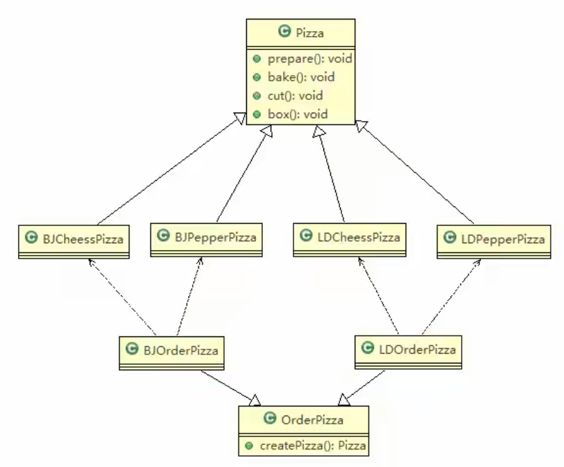

# 披萨订购

看一个新的需求： \
披萨项目新的需求：客户在点披萨时，可以点不同口味的披萨，比如 北京的奶酪pizza、北京的胡椒pizza 或者是伦敦的奶酪pizza、伦敦的胡椒pizza \
思路1: \
使用简单工厂模式，创建不同的简单工厂类，比如BJPizzaSimpleFactory、LDPizzaSimpleFactory 等等.从当前这个案例来说，也是可以的，但是考虑到项目的规模，以及软件的可维护性、可扩展性并不是特别好。 \
思路2: \
使用工厂方法模式

## 类图

