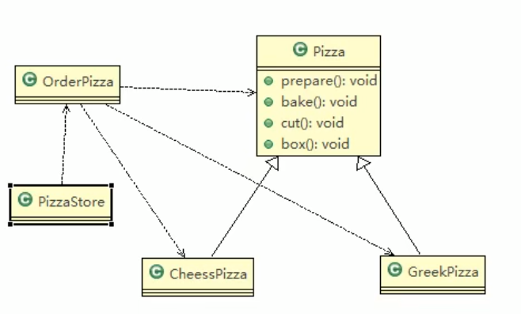
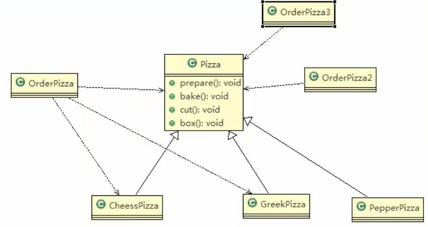

#披萨订购
看一个披萨的项目：要便于披萨种类的扩展，要便于维护
1) 披萨的种类很多(比如 GreekPizz、CheesePizz 等)
2) 披萨的制作有 prepare，bake, cut, box
3) 完成披萨店订购功能。

##类图

##传统的方式的优缺点
1) 优点是比较好理解，简单易操作。
2) 缺点是违反了设计模式的ocp原则，即对扩展开放，对修改关闭。即当我们给类增加新功能的时候，尽量不修改代码，或者尽可能少修改代码.
3) 比如我们这时要新增加一个Pizza的种类(Pepper披萨)，我们需要做如下修改.

##修改后的类图
