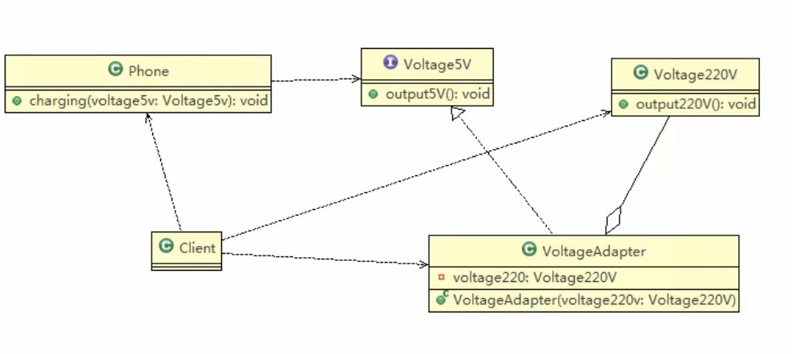

# 对象适配器模式

## 对象适配器模式介绍

1) 基本思路和类的适配器模式相同，只是将Adapter类作修改，不是继承src类，而是持有src类的实例，以解决兼容性的问题。 即：持有src类，实现dst类接口，完成src->dst的适配
2) 根据“合成复用原则”，在系统中尽量使用关联关系来替代继承关系。
3) 对象适配器模式是适配器模式常用的一种

## 对象适配器模式应用实例

1) 应用实例说明： \
   以生活中充电器的例子来讲解适配器，充电器本身相当于Adapter，220V交流电相当于src (即被适配者)，我们的目dst(即目标)是5V直流电，使用对象适配器模式完成。
2) 类图 \
   

## 注意事项和细节

1) 对象适配器和类适配器其实算是同一种思想，只不过实现方式不同。根据合成复用原则，使用组合替代继承， 所以它解决了类适配器必须继承src的局限性问题，也不再要求dst必须是接口。
2) 使用成本更低，更灵活。