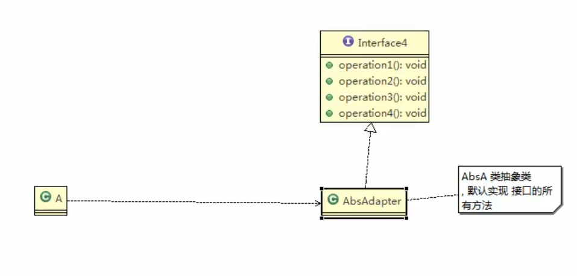

# 接口适配器模式

## 接口适配器模式介绍

1) 一些书籍称为：适配器模式(Default Adapter Pattern)或缺省适配器模式。
2) 当不需要全部实现接口提供的方法时，可先设计一个抽象类实现接口，并为该接口中每个方法提供一个默认实现（空方法），那么该抽象类的子类可有选择地覆盖父类的某些方法来实现需求
3) 适用于一个接口不想使用其所有的方法的情况。

## 接口适配器模式应用实例

Android中的属性动画ValueAnimator类可以通过addListener(AnimatorListener listener)方法添加监听器， 那么常规写法如下：

```
ValueAnimator valueAnimator=ValueAnimator.ofInt(0,100);
        valueAnimator.addListener(new Animator.AnimatorListener(){
@Override
public void onAnimationStart(Animator animation){
        }

@Override
public void onAnimationEnd(Animator animation){
        }

@Override
public void onAnimationCancel(Animator animation){
        }

@Override
public void onAnimationRepeat(Animator animation){
        }
        });
        valueAnimator.start();
```

有时候我们不想实现Animator.AnimatorListener接口的全部方法，我们只想监听onAnimationStart，我们会如下写：

```
ValueAnimator valueAnimator=ValueAnimator.ofInt(0,100);
        valueAnimator.addListener(new AnimatorListenerAdapter(){
@Override
public void onAnimationStart(Animator animation){
        //xxxx具体实现
        }
        });
        valueAnimator.start();
```

AnimatorListenerAdapter类，就是一个接口适配器，代码如下：它空实现了Animator.AnimatorListener类(src)的所有方法。

```java
public abstract class AnimatorListenerAdapter implements Animator.AnimatorListenerAnimator.AnimatorPauseListener {
    @Override //默认实现
    public void onAnimationCancel(Animator animation) {
    }

    @Override
    public void onAnimationEnd(Animator animation) {
    }

    @Override
    public void onAnimationRepeat(Animator animation) {
    }

    @Override
    public void onAnimationStart(Animator animation) {
    }

    @Override
    public void onAnimationPause(Animator animation) {
    }

    @Override
    public void onAnimationResume(Animator animation) {
    }
}
```

AnimatorListener是一个接口。

```java
public static interface AnimatorListener {
    void onAnimationStart(Animator animation);

    void onAnimationEnd(Animator animation);

    void onAnimationCancel(Animator animation);

    void onAnimationRepeat(Animator animation);
}
```

程序里的匿名内部类就是Listener具体实现类。

```
new AnimatorListenerAdapter(){
@Override
public void onAnimationStart(Animator animation){
        //xxxx具体实现
        }
        }
```

## 类图

