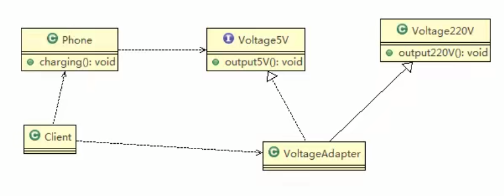

# 类适配器模式

## 类适配器模式介绍

基本介绍：Adapter类，通过继承 src类，实现 dst 类接口，完成src->dst的适配。

## 类适配器模式应用实例

1) 应用实例说明： \
   以生活中充电器的例子来讲解适配器，充电器本身相当于Adapter，220V交流电相当于src (即被适配者)，我们的目dst(即目标)是5V直流电 \
   
2) 类图 \
   

## 注意事项和细节

1) Java是单继承机制，所以类适配器需要继承src类这一点算是一个缺点，因为这要求dst必须是接口，有一定局限性;
2) src类的方法在Adapter中都会暴露出来，也增加了使用的成本。
3) 由于其继承了src类，所以它可以根据需求重写src类的方法，使得Adapter的灵活性增强了。