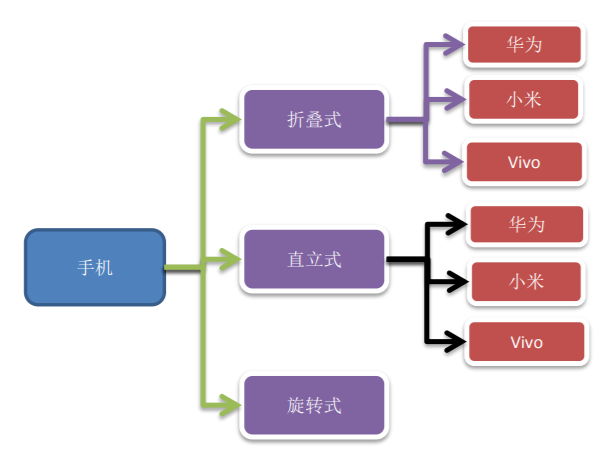
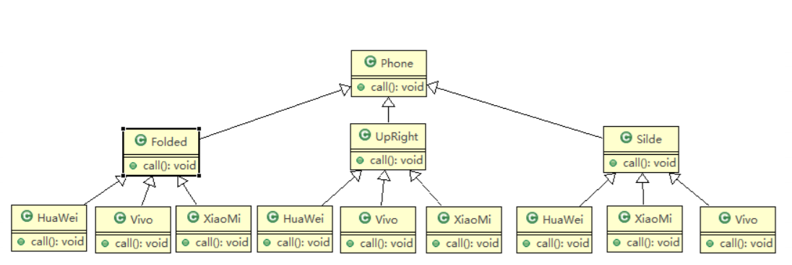

# 手机操作问题传统方案

## 需求

现在对不同手机类型的不同品牌实现操作编程(比如：开机、关机、上网，打电话等)， 如图： \

## 类图

## 问题分析

1) 扩展性问题(类爆炸)，如果我们再增加手机的样式(旋转式)，就需要增加各个品牌手机的类，同样如果我们增加一个手机品牌，也要在各个手机样式类下增加
2) 违反了单一职责原则，当我们增加手机样式时，要同时增加所有品牌的手机，这样增加了代码维护成本
3) 解决方案 -> 桥接模式