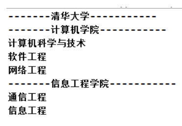

# 学校院系展示传统方式

## 需求

编写程序展示一个学校院系结构：需求是这样，要在一个页面中展示出学校的院系组成，一个学校有多个学院，一个学院有多个系。如图： \

## 类图

## 问题分析

1) 将学院看做是学校的子类，系是学院的子类，这样实际上是站在组织大小来进行分层次的
2) 实际上我们的要求是 ：在一个页面中展示出学校的院系组成，一个学校有多个学院，一个学院有多个系， 因此这种方案，不能很好实现的管理的操作，比如对学院、系的添加，删除，遍历等
3) 解决方案：把学校、院、系都看做是组织结构，他们之间没有继承的关系，而是一个树形结构，可以更好的实现管理操作。 -> 组合模式