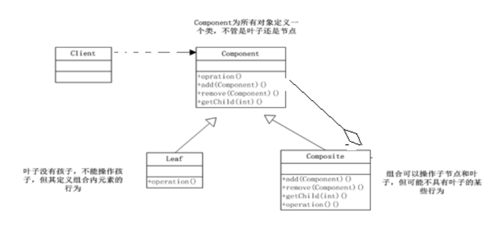
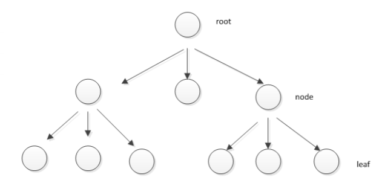

# 组合模式

## 基本介绍

1) 组合模式（Composite Pattern），又叫部分整体模式，它创建了对象组的树形结构，将对象组合成树状结构以表示“整体-部分”的层次关系。
2) 组合模式依据树形结构来组合对象，用来表示部分以及整体层次。
3) 这种类型的设计模式属于结构型模式。
4) 组合模式使得用户对单个对象和组合对象的访问具有一致性，即：组合能让客户以一致的方式处理个别对象以及组合对象

## 组合模式的原理类图

 \
对原理结构图的说明--即(组合模式的角色及职责)

1) Component：这是组合中对象声明接口，在适当情况下，实现所有类共有的接口默认行为,用于访问和管理Component子部件, Component可以是抽象层
2) Leaf：在组合中表示叶子节点。叶子结点没有子节点。
3) Composite：非叶子节点。用于存储子部件，在Component接口中实现子部件的相关操作，比如增加(add)，删除(delete)...

## 组合模式解决的问题

1) 组合模式解决这样的问题，当我们的要处理的对象可以生成一颗树形结构，而我们要对树上的节点和叶子进行操作时，它能够提供一致的方式，而不用考虑它是节点还是叶子
2) 对应的示意图： \
   

## 注意事项和细节

1) 简化客户端操作。客户端只需要面对一致的对象而不用考虑整体部分或者节点叶子的问题
2) 具有较强的扩展性。当我们要更改组合对象时，我们只需要调整内部的层次关系，客户端不用做出任何改动
3) 方便创建出复杂的层次结构。客户端不用理会组合里面的组成细节，容易添加节点或者叶子从而创建出复杂的树形结构
4) 需要遍历组织机构，或者处理的对象具有树形结构时, 非常适合使用组合模式.
5) 要求较高的抽象性，如果节点和叶子有很多差异性的话，比如很多方法和属性都不一样，不适合使用组合模式