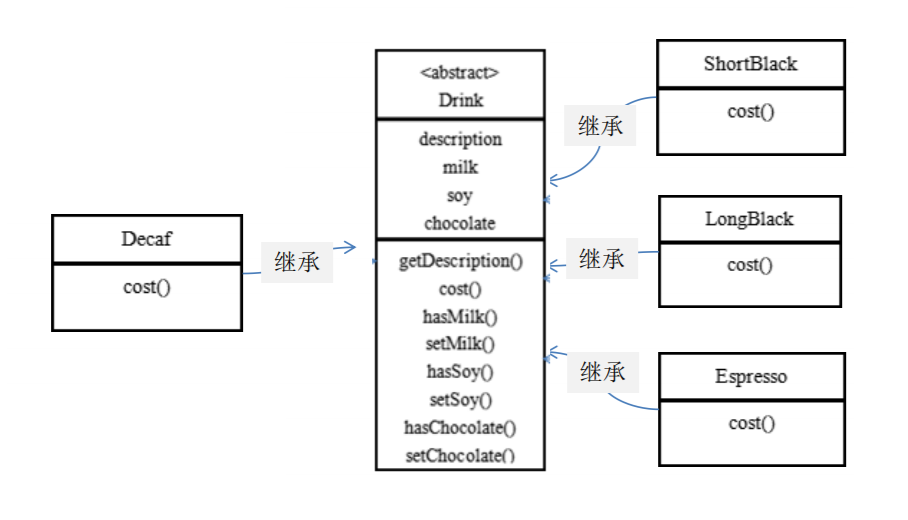

# 星巴克咖啡订单传统方式2

前面分析到方案1因为咖啡单品+调料组合会造成类的倍增，因此可以做改进，将调料内置到Drink类，这样就不会造成类数量过多。从而提高项目的维护性(如下图) \
 \
说明: milk，soy，chocolate 可以设计为Boolean，表示是否要添加相应的调料

## 问题分析

1) 方案2可以控制类的数量，不至于造成很多的类
2) 在增加或者删除调料种类时，代码的维护量很大
3) 考虑到用户可以添加多份调料时，可以将hasMilk 返回一个对应int
4) 考虑使用装饰者模式