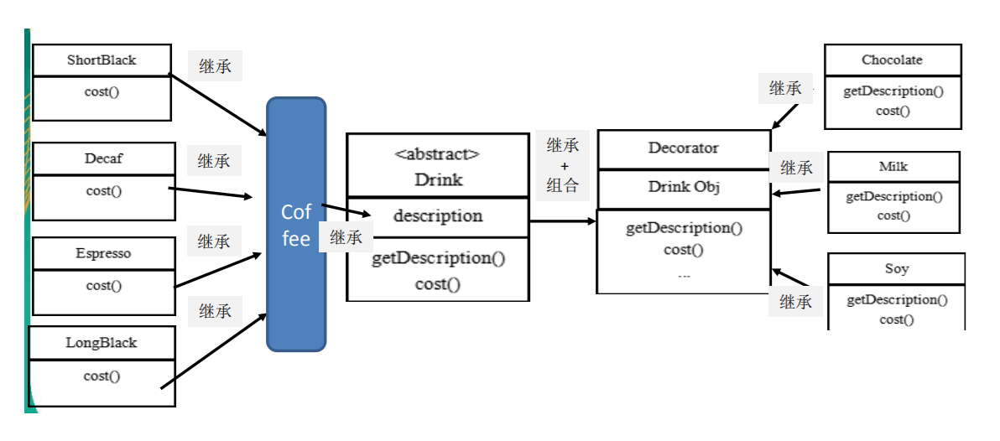
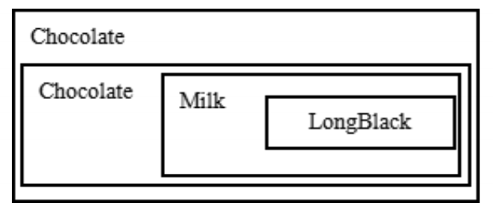

# 星巴克咖啡订单装饰者模式

## 类图

 \
说明：

1) Drink 类就是前面说的抽象类， Component
2) ShortBlack 就单品咖啡
3) Decorator 是一个装饰类，含有一个被装饰的对象(Drink obj)
4) Decorator 的cost 方法 进行一个费用的叠加计算，递归的计算价格

## 装饰者模式下的订单：2份巧克力+一份牛奶的LongBlack

 \
说明：

1) Milk包含了LongBlack
2) 一份Chocolate包含了(Milk+LongBlack)
3) 一份Chocolate包含了(Chocolate+Milk+LongBlack)
4) 这样不管是什么形式的单品咖啡+调料组合，通过递归方式可以方便的组合和维护