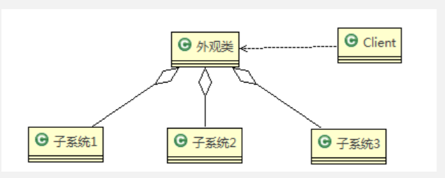

# 外观模式

## 基本介绍

1) 外观模式（Facade），也叫过程模式：外观模式为子系统中的一组接口提供一个一致的界面，此模式定义了一个高层接口，这个接口使得这一子系统更加容易使用
2) 外观模式通过定义一个一致的接口，用以屏蔽内部子系统的细节，使得调用端只需跟这个接口发生调用，而无需关心这个子系统的内部细节

## 原理类图

 \
原理类图的说明(外观模式的角色)：

1) 外观类(Facade): 为调用端提供统一的调用接口，外观类知道哪些子系统负责处理请求,从而将调用端的请求代理给适当子系统对象
2) 调用者(Client): 外观接口的调用者
3) 子系统的集合：指模块或者子系统，处理Facade 对象指派的任务，他是功能的实际提供者

## 注意事项和细节

1) 外观模式对外屏蔽了子系统的细节，因此外观模式降低了客户端对子系统使用的复杂性
2) 外观模式对客户端与子系统的耦合关系，让子系统内部的模块更易维护和扩展
3) 通过合理的使用外观模式，可以帮我们更好的划分访问的层次
4) 当系统需要进行分层设计时，可以考虑使用Facade模式
5) 在维护一个遗留的大型系统时，可能这个系统已经变得非常难以维护和扩展，此时可以考虑为新系统开发一个Facade类，来提供遗留系统的比较清晰简单的接口，让新系统与Facade类交互，提高复用性
6) 不能过多的或者不合理地使用外观模式，使用外观模式好，还是直接调用模块好。要以让系统有层次，利于维护为目的

## [实例](../facade)