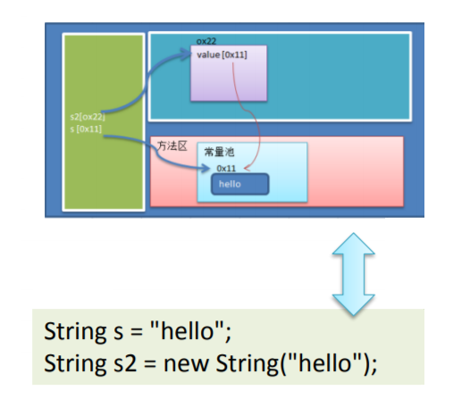

# 享元模式（共享对象）

## 基本介绍

1) 享元模式（Flyweight Pattern） 也叫蝇量模式: 运用共享技术有效地支持大量细粒度的对象
2) 常用于系统底层开发，解决系统的性能问题。像数据库连接池，里面都是创建好的连接对象，在这些连接对象中有我们需要的则直接拿来用，避免重新创建，如果没有我们需要的，则创建一个
3) 享元模式能够解决重复对象的内存浪费的问题，当系统中有大量相似对象，需要缓冲池时。不需总是创建新对象，可以从缓冲池里拿。这样可以降低系统内存，同时提高效率
4) 享元模式经典的应用场景就是池技术了，String常量池、数据库连接池、缓冲池等等都是享元模式的应用，享元模式是池技术的重要实现方式 \
   

## 原理类图

 \
对原理图的说明-即(模式的角色及职责)：

1) FlyWeight 是抽象的享元角色, 他是产品的抽象类, 同时定义出对象的外部状态和内部状态(后面介绍)的接口或实现
2) ConcreteFlyWeight 是具体的享元角色，是具体的产品类，实现抽象角色定义相关业务
3) UnsharedConcreteFlyweight 是不可共享的角色，一般不会出现在享元工厂。
4) FlyweightFactory 享元工厂类，用于构建一个池容器（集合），同时提供从池中获取对象方法

## 内部状态和外部状态

比如围棋、五子棋、跳棋，它们都有大量的棋子对象，围棋和五子棋只有黑白两色，跳棋颜色多一 点，所以棋子颜色就是棋子的内部状态；而各个棋子之间的差别就是位置的不同，当我们落子后， 落子颜色是定的，但位置是变化的，所以棋子坐标就是棋子的外部状态

1) 享元模式提出了两个要求：细粒度和共享对象。这里就涉及到内部状态和外部状态了，即将对象的信息分为两个部分：内部状态和外部状态
2) 内部状态指对象共享出来的信息，存储在享元对象内部且不会随环境的改变而改变
3) 外部状态指对象得以依赖的一个标记，是随环境改变而改变的、不可共享的状态。
4)

举个例子：围棋理论上有361个空位可以放棋子，每盘棋都有可能有两三百个棋子对象产生，因为内存空间有限，一台服务器很难支持更多的玩家玩围棋游戏，如果用享元模式来处理棋子，那么棋子对象就可以减少到只有两个实例（黑与白（内部信息），然后将位置信息（外部信息）保存在这两个实例中），这样就很好的解决了对象的开销问题

## 注意事项和细节

1) 在享元模式这样理解，“享”就表示共享，“元”表示对象
2) 系统中有大量对象，这些对象消耗大量内存，并且对象的状态大部分可以外部化时，我们就可以考虑选用享元模式
3) 用唯一标识码判断，如果在内存中有，则返回这个唯一标识码所标识的对象，用HashMap/HashTable存储
4) 享元模式大大减少了对象的创建，降低了程序内存的占用，提高效率
5) 享元模式提高了系统的复杂度。需要分离出内部状态和外部状态，而外部状态具有固化特性，不应该随着内部状态的改变而改变，这是我们使用享元模式需要注意的地方
6) 使用享元模式时，注意划分内部状态和外部状态，并且需要有一个工厂类加以控制。
7) 享元模式经典的应用场景是需要缓冲池的场景，比如 String常量池、数据库连接池