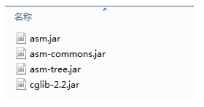

# Cglib代理

## 基本介绍

1) 静态代理和JDK代理模式都要求目标对象是实现一个接口，但是有时候目标对象只是一个单独的对象，并没有实现任何的接口，这个时候可使用目标对象子类来实现代理-这就是Cglib代理
2) Cglib代理也叫作子类代理，它是在内存中构建一个子类对象从而实现对目标对象功能扩展， 有些书也将Cglib代理归属到动态代理
3) Cglib是一个强大的高性能的代码生成包，它可以在运行期扩展java类与实现java接口.它广泛的被许多AOP的框架使用，例如Spring AOP，实现方法拦截
4) 在AOP编程中如何选择代理模式：
    1. 目标对象需要实现接口，用JDK代理
    2. 目标对象不需要实现接口，用Cglib代理
5) Cglib包的底层是通过使用字节码处理框架ASM来转换字节码并生成新的类

## Cglib代理模式实现步骤

1) 需要引入cglib的jar文件 \
   
2) 在内存中动态构建子类，注意代理的类不能为final，否则报错java.lang.IllegalArgumentException
3) 目标对象的方法如果为final/static,那么就不会被拦截,即不会执行目标对象额外的业务方法

## [实例](../Cglib代理)