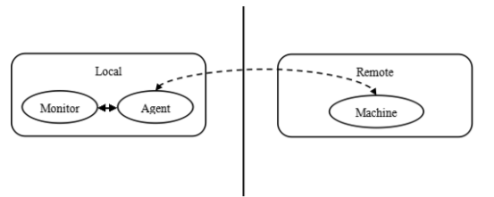

# 代理模式

## 基本介绍

1) 代理模式：为一个对象提供一个替身，以控制对这个对象的访问。即通过代理对象访问目标对象.这样做的好处是:可以在目标对象实现的基础上,增强额外的功能操作,即扩展目标对象的功能。
2) 被代理的对象可以是远程对象、创建开销大的对象或需要安全控制的对象。
3) 代理模式有不同的形式, 主要有三种[静态代理](静态代理/静态代理.md)、[动态代理](动态代理/动态代理.md) (JDK代理、接口代理)和[Cglib代理](Cglib代理/Cglib代理.md) (
   可以在内存动态的创建对象，而不需要实现接口，他是属于动态代理的范畴) 。
4) 代理模式示意图 \
   

## 代理模式(Proxy)的变体

1) 防火墙代理： \
   内网通过代理穿透防火墙，实现对公网的访问。
2) 缓存代理： \
   比如：当请求图片文件等资源时，先到缓存代理取，如果取到资源则ok,如果取不到资源， 再到公网或者数据库取，然后缓存。
3) 远程代理： \
   远程对象的本地代表，通过它可以把远程对象当本地对象来调用。远程代理通过网络和真正的远程对象沟通信息。 \
   
4) 同步代理：主要使用在多线程编程中，完成多线程间同步工作