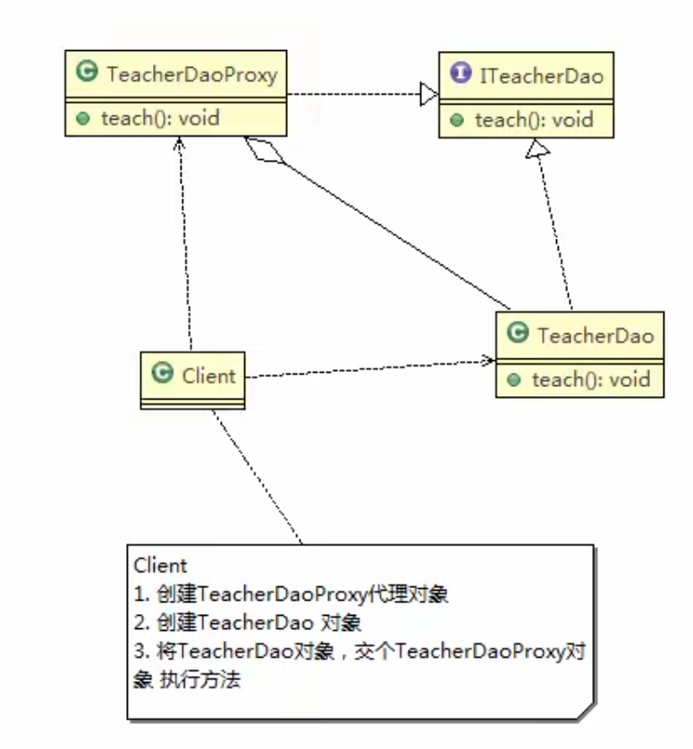

# 静态代理应用实例

## 具体要求

1) 定义一个接口:ITeacherDao
2) 目标对象TeacherDAO实现接口ITeacherDAO
3) 使用静态代理方式,就需要在代理对象TeacherDAOProxy中也实现ITeacherDAO
4) 调用的时候通过调用代理对象的方法来调用目标对象
5) 特别提醒：代理对象与目标对象要实现相同的接口，然后通过调用相同的方法来调用目标对象的方法

## 类图

