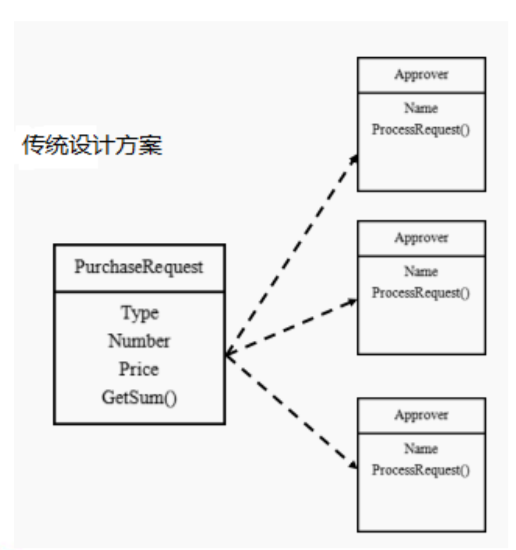

# OA系统审批传统方式

## 需求

学校OA系统的采购审批项目：

1) 采购员采购教学器材
2) 如果金额 小于等于5000, 由教学主任审批 （0<=x<=5000）
3) 如果金额 小于等于10000, 由院长审批 (5000<x<=10000)
4) 如果金额 小于等于30000, 由副校长审批 (10000<x<=30000)
5) 如果金额 超过30000以上，有校长审批 ( 30000<x)

## 类图

## 问题分析

1) 传统方式是：接收到一个采购请求后，根据采购金额来调用对应的Approver (审批人)完成审批。
2) 传统方式的问题分析 : 客户端这里会使用到 分支判断(比如 switch) 来对不同的采购请求处理， 这样就存在如下问题
    1) 如果各个级别的人员审批金额发生变化，在客户端的也需要变化
    2) 客户端必须明确的知道 有多少个审批级别和访问
3) 这样 对一个采购请求进行处理 和 Approver (审批人) 就存在强耦合关系，不利于代码的扩展和维护
4) 解决方案 =》 职责链模式