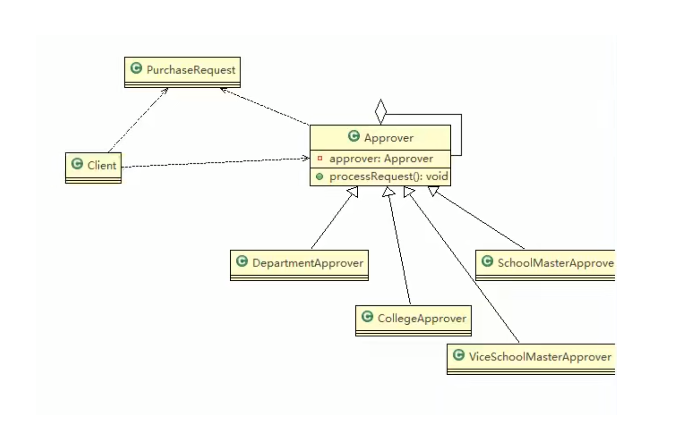

# OA系统审批职责链模式

## 需求

学校OA系统的采购审批项目：

1) 采购员采购教学器材
2) 如果金额 小于等于5000, 由教学主任审批 （0<=x<=5000）
3) 如果金额 小于等于10000, 由院长审批 (5000<x<=10000)
4) 如果金额 小于等于30000, 由副校长审批 (10000<x<=30000)
5) 如果金额 超过30000以上，有校长审批 ( 30000<x)

## 类图

