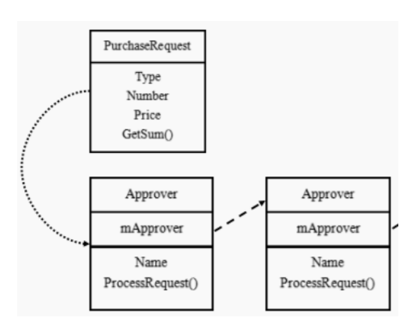
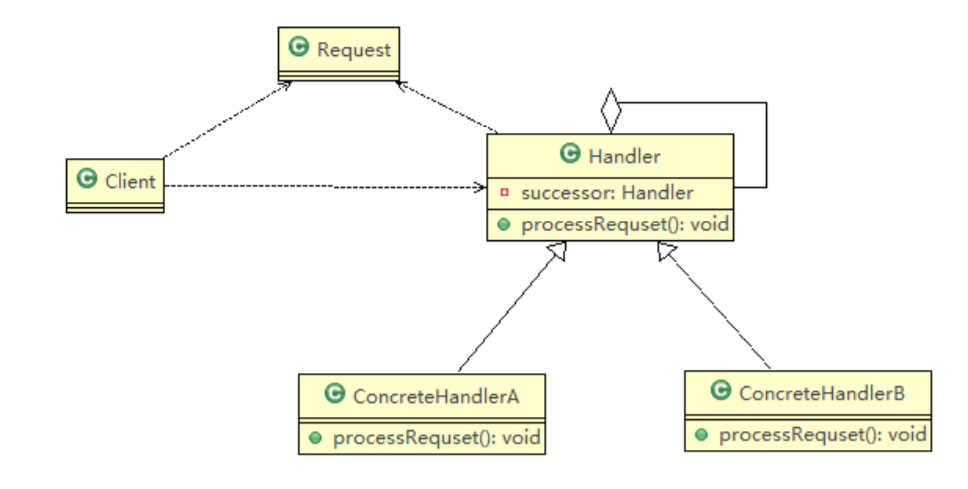

# 职责链模式

## 基本介绍

1) 职责链模式（Chain of Responsibility Pattern），又叫责任链模式，为请求创建了一个接收者对象的链(简单示意图)。这种模式对请求的发送者和接收者进行解耦
2) 职责链模式通常每个接收者都包含对另一个接收者的引用。如果一个对象不能处理该请求，那么它会把相同的请求传给下一个接收者，依此类推
3) 这种类型的设计模式属于行为型模式 \
   

## 原理类图

职责链模式（Chain Of Responsibility），使多个对象都有机会处理请求，从而避免请求的发送者和接收者之间的耦合关系。将这个对象连成一条链，并沿着这条链传递该请求，直到有一个对象处理它为止 \
 \
对原理类图的说明-即(职责链模式的角色及职责)：

1) Handler : 抽象的处理者, 定义了一个处理请求的接口, 同时含义另外Handler
2) ConcreteHandlerA , B：是具体的处理者, 处理它自己负责的请求， 可以访问它的后继者(即下一个处理者), 如果可以处理当前请求，则处理，否则就将该请求交个 后继者去处理，从而形成一个职责链
3) Request：含义很多属性，表示一个请求

## 注意事项和细节

1) 将请求和处理分开，实现解耦，提高系统的灵活性
2) 简化了对象，使对象不需要知道链的结构
3) 性能会受到影响，特别是在链比较长的时候，因此需控制链中最大节点数量，一般通过在Handler中设置一个最大节点数量，在setNext()方法中判断是否已经超过阀值，超过则不允许该链建立，避免出现超长链无意识地破坏系统性能
4) 调试不方便。采用了类似递归的方式，调试时逻辑可能比较复杂
5) 最佳应用场景：有多个对象可以处理同一个请求时，比如：多级请求、请假/加薪等审批流程、Java Web中Tomcat对Encoding的处理、拦截器

## [实例](../chainofresponsibility)