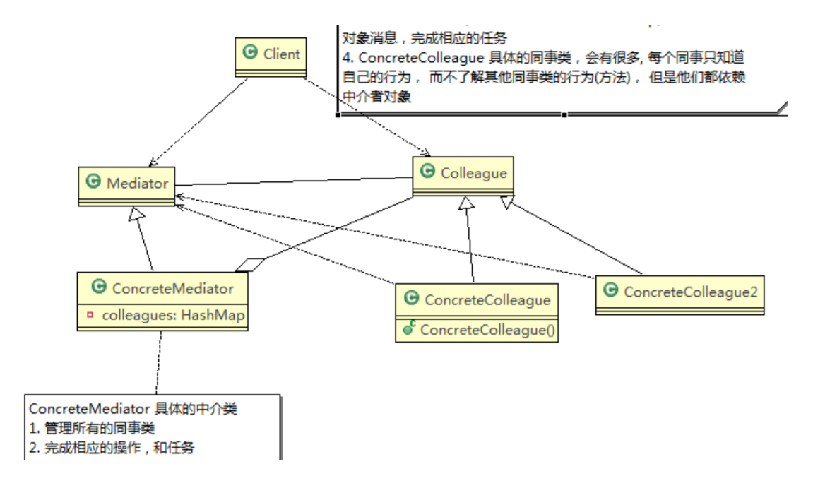

# 中介者模式

## 基本介绍

1) 中介者模式（Mediator Pattern），用一个中介对象来封装一系列的对象交互。中介者使各个对象不需要显式地相互引用，从而使其耦合松散，而且可以独立地改变它们之间的交互
2) 中介者模式属于行为型模式，使代码易于维护
3) 比如MVC模式，C（Controller控制器）是M（Model模型）和V（View视图）的中介者，在前后端交互时起到了中间人的作用

## 原理类图

 \
对原理类图的说明-即(中介者模式的角色及职责)：

1) Mediator 就是抽象中介者，定义了同事对象到中介者对象的接口
2) Colleague 是抽象同事类
3) ConcreteMediator 具体的中介者对象，实现抽象方法，他需要知道所有的具体的同事类，即以一个集合来管理HashMap，并接受某个同事对象消息，完成相应的任务
4) ConcreteColleague 具体的同事类，会有很多，每个同事只知道自己的行为，而不了解其他同事类的行为（方法），但是他们都依赖中介者对象

## 注意事项和细节

1) 多个类相互耦合，会形成网状结构, 使用中介者模式将网状结构分离为星型结构，进行解耦
2) 减少类间依赖，降低了耦合，符合迪米特原则
3) 中介者承担了较多的责任，一旦中介者出现了问题，整个系统就会受到影响
4) 如果设计不当，中介者对象本身变得过于复杂，这点在实际使用时，要特别注意