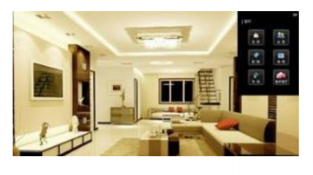

# 智能家庭管理中介者模式

## 需求

智能家庭项目：

1) 智能家庭包括各种设备，闹钟、咖啡机、电视机、窗帘 等
2) 主人要看电视时，各个设备可以协同工作，自动完成看电视的准备工作，比如流程为：闹铃响起->咖啡机开始做咖啡->窗帘自动落下->电视机开始播放  
   

## 类图

## 智能家庭的操作流程

1. 创建ConcreteMediator对象
2. 创建各个同事类对象，比如：Alarm，CoffeeMachine，TV...
3. 在创建同事类对象的时候，就直接通过构造器，加入到colleagueMap
4. 同事类对象，可以调用sendMessage，最终会去调用ConcreteMediator的getMessage方法
5. getMessage会根据接收到的同事对象发出的消息来协调调用其他的同事对象
6. 可以看到getMessage是核心方法，完成相应任务