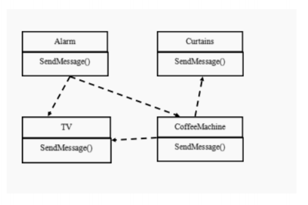

# 智能家庭管理传统方案

## 需求

智能家庭项目：

1) 智能家庭包括各种设备，闹钟、咖啡机、电视机、窗帘 等
2) 主人要看电视时，各个设备可以协同工作，自动完成看电视的准备工作，比如流程为：闹铃响起->咖啡机开始做咖啡->窗帘自动落下->电视机开始播放
   

## 类图

## 问题分析

1) 当各电器对象有多种状态改变时，相互之间的调用关系会比较复杂
2) 各个电器对象彼此联系，你中有我，我中有你，不利于松耦合.
3) 各个电器对象之间所传递的消息(参数)，容易混乱
4) 当系统增加一个新的电器对象时，或者执行流程改变时，代码的可维护性、扩展性都不理想 -> 考虑[中介者模式](../中介者模式.md)