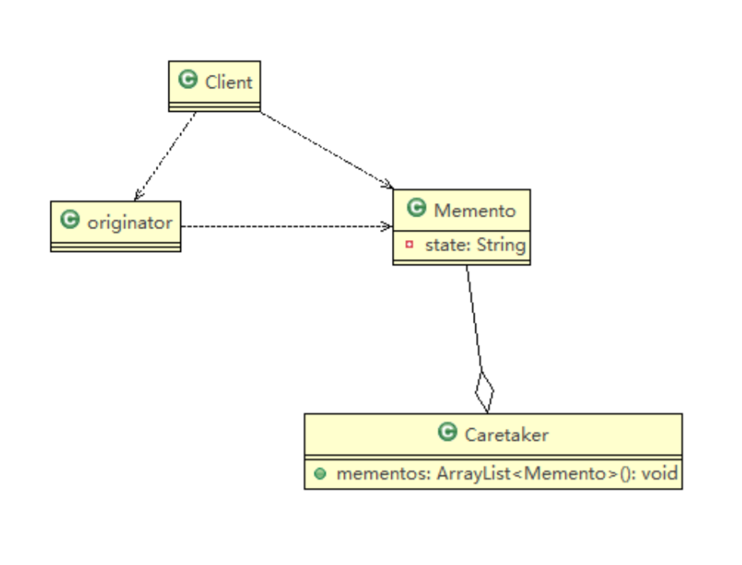

# 备忘录模式

## 基本介绍

1) 备忘录模式（Memento Pattern）在不破坏封装性的前提下，捕获一个对象的内部状态，并在该对象之外保存这个状态。这样以后就可将该对象恢复到原先保存的状态
2)
可以这里理解备忘录模式：现实生活中的备忘录是用来记录某些要去做的事情，或者是记录已经达成的共同意见的事情，以防忘记了。而在软件层面，备忘录模式有着相同的含义，备忘录对象主要用来记录一个对象的某种状态，或者某些数据，当要做回退时，可以从备忘录对象里获取原来的数据进行恢复操作
3) 备忘录模式属于行为型模式

## 原理类图

 \
对原理类图的说明-即(备忘录模式的角色及职责):

1) originator : 对象(需要保存状态的对象)
2) Memento ： 备忘录对象,负责保存好记录，即Originator内部状态
3) Caretaker: 守护者对象,负责保存多个备忘录对象， 使用集合管理，提高效率
4) 说明：如果希望保存多个originator对象的不同时间的状态，也可以，只需要 HashMap <String, 集合>

## 注意事项和细节

1) 给用户提供了一种可以恢复状态的机制，可以使用户能够比较方便地回到某个历史的状态
2) 实现了信息的封装，使得用户不需要关心状态的保存细节
3) 如果类的成员变量过多，势必会占用比较大的资源，而且每一次保存都会消耗一定的内存, 这个需要注意
4) 适用的应用场景：
    1. 后悔药。
    2. 打游戏时的存档。
    3. Windows 里的 ctri + z。
    4. IE 中的后退。
    5. 数据库的事务管理
5) 为了节约内存，备忘录模式可以和原型模式配合使用