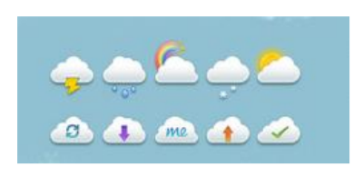
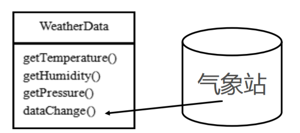
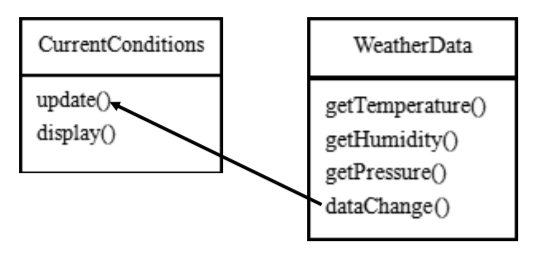

# 天气预报普通方案

## 需求

1) 气象站可以将每天测量到的温度，湿度，气压等等以公告的形式发布出去(比如发布到自己的网站或第三方)。
2) 需要设计开放型API，便于其他第三方也能接入气象站获取数据。
3) 提供温度、气压和湿度的接口
4) 测量数据更新时，要能实时的通知给第三方 \
   

## 普通方案

通过对气象站项目的分析，我们可以初步设计出一个WeatherData类 \
 \
说明:

1) 通过getXxx方法，可以让第三方接入，并得到相关信息
2) 当数据有更新时，气象站通过调用dataChange() 去更新数据，当第三方再次获取时，就能得到最新数据，当然也可以推送

## 类图

 \
CurrentConditions(当前的天气情况)可以理解成是我们气象局的网站（推送）

## 问题分析

1) 其他第三方接入气象站获取数据的问题
2) 无法在运行时动态的添加第三方
3) 违反ocp原则=>观察者模式 在WeatherData中，当增加一个第三方，都需要创建一个对应的第三方的公告板对象，并加入到dataChange, 不利于维护，也不是动态加入

```
public void dataChange(){
        currentConditions.update(getTemperature(),getPressure(),getHumidity());
        }
```

