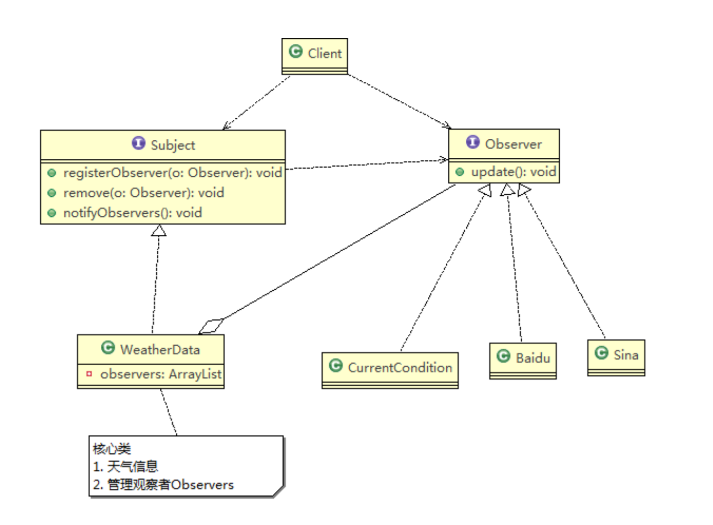

# 天气预报观察者模式

## 需求

1) 气象站可以将每天测量到的温度，湿度，气压等等以公告的形式发布出去(比如发布到自己的网站或第三方)。
2) 需要设计开放型API，便于其他第三方也能接入气象站获取数据。
3) 提供温度、气压和湿度的接口
4) 测量数据更新时，要能实时的通知给第三方 \
   

## 类图

## 观察者模式的好处

1) 观察者模式设计后，会以集合的方式来管理用户(Observer)，包括注册，移除和通知。
2) 这样，我们增加观察者(这里可以理解成一个新的公告板)，就不需要去修改核心类WeatherData不会修改代码，遵守了ocp原则。