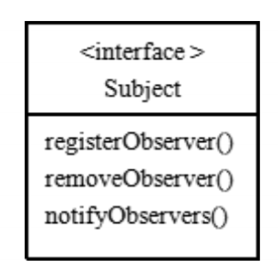
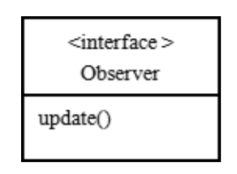

# 观察者模式

## 原理

* 观察者模式类似订牛奶业务
    1) 奶站/气象局：Subject
    2) 用户/第三方网站：Observer
* Subject：登记注册、移除和通知

  
    1) registerObserver 注册
    2) removeObserver 移除
    3) notifyObservers() 通知所有的注册的用户，根据不同需求，可以是更新数据，让用户来取，也可能是实施推送，看具体需求定
* Observer：接收输入

* 观察者模式： \
  观察者模式：对象之间多对一依赖的一种设计方案，被依赖的对象为Subject，依赖的对象为Observer，Subject通知Observer变化,比如这里的奶站是Subject，是1的一方。用户时Observer，是多的一方

## 观察者模式的好处

观察者模式设计后，会以集合的方式来管理用户(Observer)，包括注册，移除和通知

## [实例](../observer)