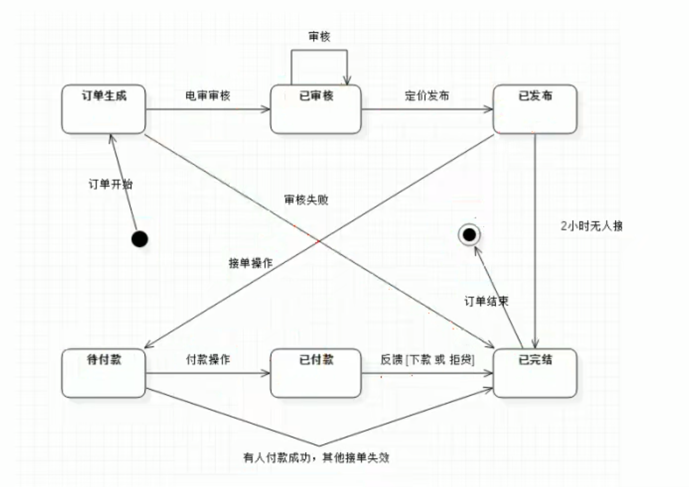
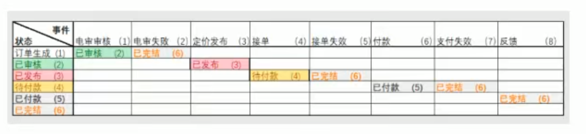
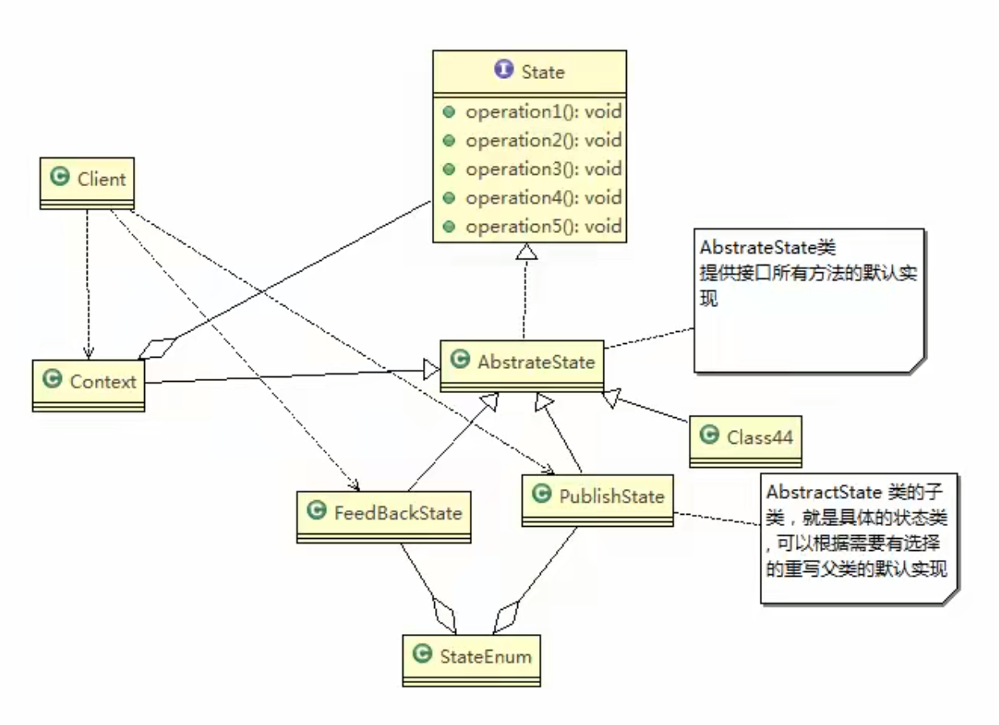

# 借贷平台状态模式

## 需求

借贷平台的订单，有审核-发布-抢单 等等 步骤，随着操作的不同，会改变订单的状态, 项目中的这个模块实现就会使用到状态模式

## 传统方式的问题

通常通过if/else判断订单的状态，从而实现不同的逻辑，伪代码如下：

```
if(审核) {
//审核逻辑
} else if(发布) {
//发布逻辑
} else if(接单) {
//接单逻辑
}
```

问题分析： \
这类代码难以应对变化，在添加一种状态时，我们需要手动添加if/else，在添加一种功能时，要对所有的状态进行判断。因此代码会变得越来越臃肿，并且一旦没有处理某个状态，便会发生极其严重的BUG，难以维护

## 订单流程的状态图



## 横纵坐标关系表



## 类图


