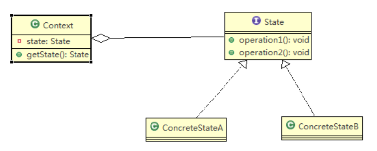

# 状态模式

## 基本介绍

1) 状态模式（State Pattern）：它主要用来解决对象在多种状态转换时，需要对外输出不同的行为的问题。状态和行为是一一对应的，状态之间可以相互转换
2) 当一个对象的内在状态改变时，允许改变其行为，这个对象看起来像是改变了其类

## 原理类图

 \
对原理类图的说明-即(状态模式的角色及职责)：

1) Context 类为环境角色, 用于维护State实例,这个实例定义当前状态
2) State 是抽象状态角色,定义一个接口封装与Context 的一个特点接口相关行为
3) ConcreteState 具体的状态角色，每个子类实现一个与Context 的一个状态相关行为

## 注意事项和细节

1) 代码有很强的可读性。状态模式将每个状态的行为封装到对应的一个类中
2) 方便维护。将容易产生问题的if-else语句删除了，如果把每个状态的行为都放到一个类中，每次调用方法时都要判断当前是什么状态，不但会产出很多if-else语句，而且容易出错
3) 符合“开闭原则”。容易增删状态
4) 会产生很多类。每个状态都要一个对应的类，当状态过多时会产生很多类，加大维护难度
5) 应用场景：当一个事件或者对象有很多种状态，状态之间会相互转换，对不同的状态要求有不同的行为的时候，可以考虑使用状态模式