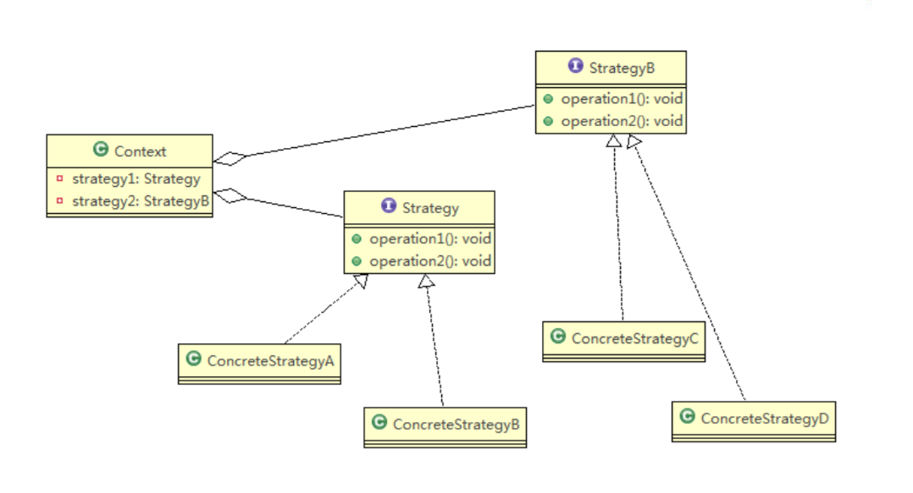

# 策略模式

## 基本介绍

1) 策略模式（Strategy Pattern）中，定义算法族，分别封装起来，让他们之间可以互相替换，此模式让算法的变化独立于使用算法的客户
2) 这算法体现了几个设计原则，第一、把变化的代码从不变的代码中分离出来；第二、针对接口编程而不是具体类（定义了策略接口）；第三、多用组合/聚合，少用继承（客户通过组合方式使用策略）

## 原理类图

 \
说明：从上图可以看到，客户context 有成员变量strategy或者其他的策略接口，至于需要使用到哪个策略，我们可以在构造器中指定

## 注意事项和细节

1) 策略模式的关键是：分析项目中变化部分与不变部分
2) 策略模式的核心思想是：多用组合/聚合 少用继承；用行为类组合，而不是行为的继承。更有弹性
3) 体现了“对修改关闭，对扩展开放”原则，客户端增加行为不用修改原有代码，只要添加一种策略（或者行为）即可，避免了使用多重转移语句（if..else if..else）
4) 提供了可以替换继承关系的办法：策略模式将算法封装在独立的Strategy类中使得你可以独立于其Context改变它，使它易于切换、易于理解、易于扩展
5) 需要注意的是：每添加一个策略就要增加一个类，当策略过多是会导致类数目庞大

## [实例](../strategy)