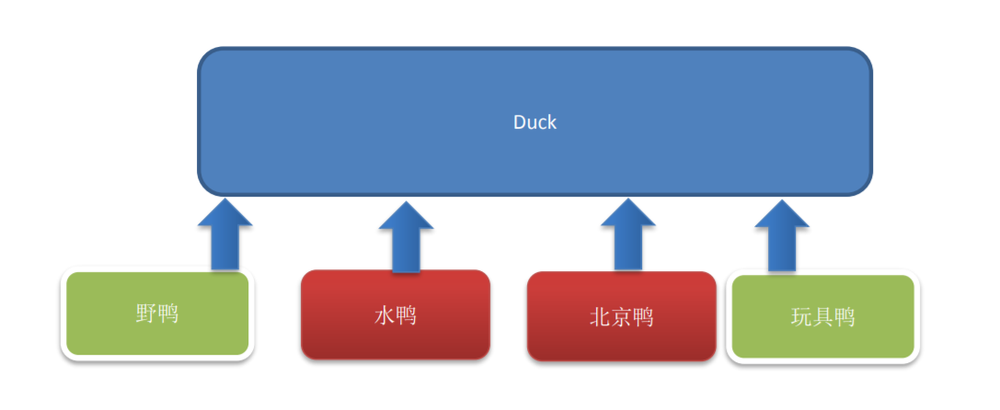
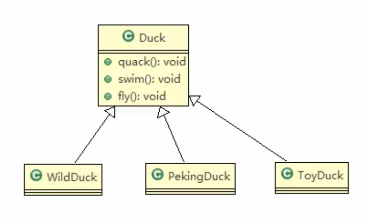

# 鸭子问题传统方式

## 需求

1) 有各种鸭子(比如 野鸭、北京鸭、水鸭等， 鸭子有各种行为，比如 叫、飞行等)
2) 显示鸭子的信息

## 传统的设计方案

## 类图

## 问题分析和解决方案

1) 其它鸭子，都继承了Duck类，所以fly让所有子类都会飞了，这是不正确的
2) 上面说的1 的问题，其实是继承带来的问题：对类的局部改动，尤其超类的局部改动，会影响其他部分。会有溢出效应
3) 为了改进1问题，我们可以通过覆盖fly 方法来解决 => 覆盖解决
4) 问题又来了，如果我们有一个玩具鸭子ToyDuck，这样就需要ToyDuck去覆盖Duck的所有实现的方法 => 解决思路 策略模式 (strategy pattern)