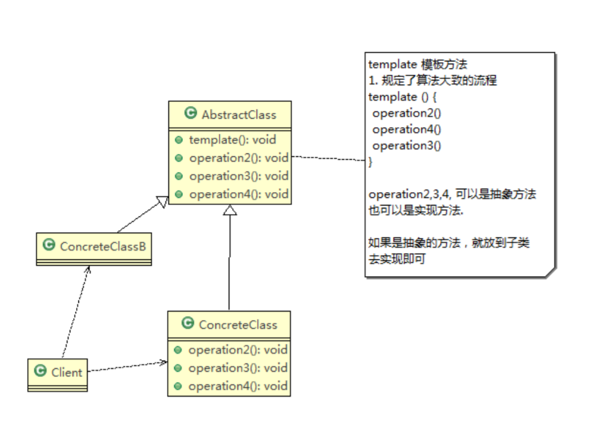

# 模板方法模式

## 基本介绍

1) 模板方法模式（Template Method Pattern），又叫模板模式(Template Pattern)，在一个抽象类公开定义了执行它的方法的模板。它的子类可以按需要重写方法实现，但调用将以抽象类中定义的方式进行。
2) 简单说，模板方法模式 定义一个操作中的算法的骨架，而将一些步骤延迟到子类中，使得子类可以不改变一个算法的结构，就可以重定义该算法的某些特定步骤
3) 这种类型的设计模式属于行为型模式。

## 原理类图

 \
对原理类图的说明-即(模板方法模式的角色及职责)：

1) AbstractClass 抽象类， 类中实现了模板方法(template)，定义了算法的骨架，具体子类需要去实现 其它的抽象方法operation2,3,4
2) ConcreteClass 实现抽象方法operation2,3,4, 以完成算法中特点子类的步骤

## 钩子方法

1) 在模板方法模式的父类中，我们可以定义一个方法，它默认不做任何事，子类可以视情况要不要覆盖它，该方法称为“钩子”。

## 注意事项和细节

1) 基本思想是：算法只存在于一个地方，也就是在父类中，容易修改。需要修改算法时，只要修改父类的模板方法或者已经实现的某些步骤，子类就会继承这些修改
2) 实现了最大化代码复用。父类的模板方法和已实现的某些步骤会被子类继承而直接使用。
3) 既统一了算法，也提供了很大的灵活性。父类的模板方法确保了算法的结构保持不变，同时由子类提供部分步骤的实现。
4) 该模式的不足之处：每一个不同的实现都需要一个子类实现，导致类的个数增加，使得系统更加庞大
5) 一般模板方法都加上final关键字， 防止子类重写模板方法
6) 模板方法模式使用场景：当要完成在某个过程，该过程要执行一系列步骤 ，这一系列的步骤基本相同，但其个别步骤在实现时 可能不同，通常考虑用模板方法模式来处理