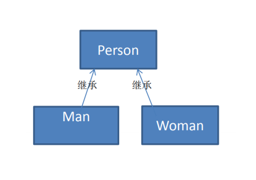

# 测评系统传统方式

## 需求

将观众分为男人和女人，对歌手进行测评，当看完某个歌手表演后，得到他们对该歌手不同的评价(评价有不同的种类，比如成功、失败等) \

## 类图

## 问题分析

1) 如果系统比较小，还是ok的，但是考虑系统增加越来越多新的功能时，对代码改动较大，违反了ocp原则， 不利于维护
2) 扩展性不好，比如 增加了 新的人员类型，或者管理方法，都不好做
3) 引出我们会使用新的设计模式 –> 访问者模式