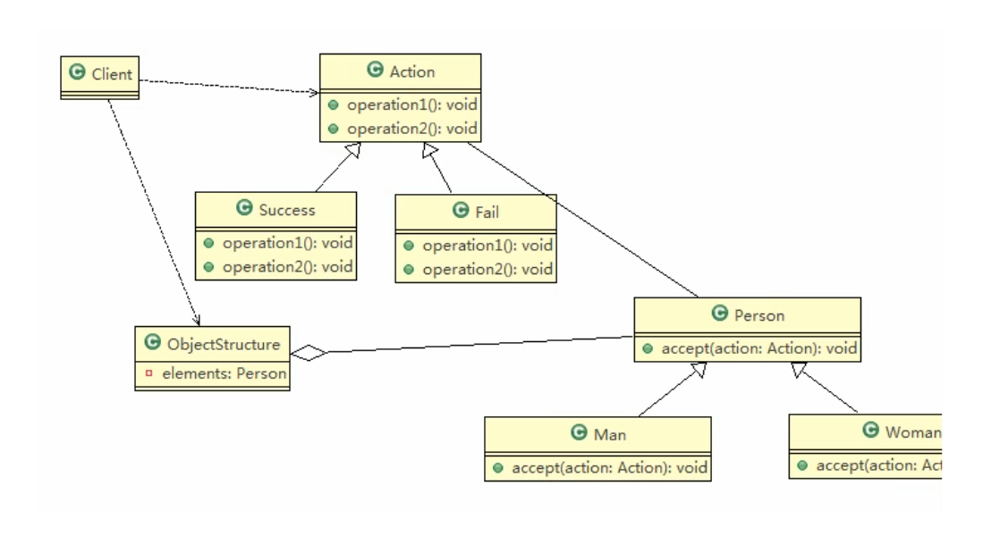

# 测评系统访问者模式

## 需求

将观众分为男人和女人，对歌手进行测评，当看完某个歌手表演后，得到他们对该歌手不同的评价(评价有不同的种类，比如成功、失败等) \

## 类图

## 小结

- 上面提到了双分派，所谓双分派是指不管类怎么变化，我们都能找到期望的方法运行。双分派意味着得到执行的操作取决于请求的种类和两个接收者的类型
- 以上述实例为例，假设我们要添加一个Wait的状态类，考察Man类和Woman类的反应，由于使用了双分派，只需增加一个Action子类即可在客户端调用即可，不需要改动任何其他类的代码