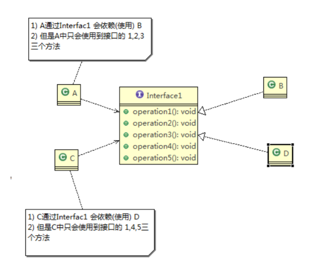
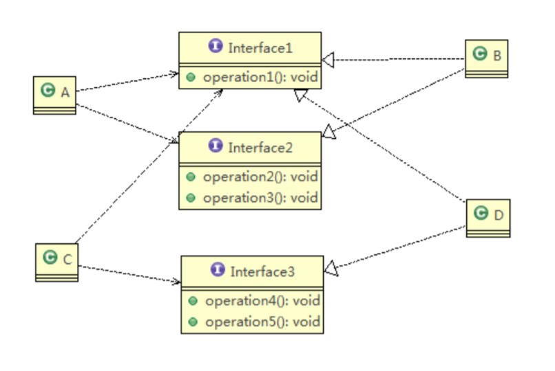

# 接口隔离原则

## 基本介绍

客户端不应该依赖它不需要的接口，即一个类对另一个类的依赖应该建立在最小的接口上

## 欠妥的设计

类A通过接口Interface1依赖类B，类C通过接口Interface1依赖类D，如果接口Interface1对于类A和类C来说不是最小接口，那么类B和类D必须去实现他们不需要的方法  

## 改进的设计

将接口Interface1拆分为独立的几个接口，类A和类C分别与他们需要的接口建立依赖关系，也就是采用接口隔离原则。接口Interface1中出现的方法，根据实际情况拆分为三个接口  

## [实例](../interfacesegregation)
