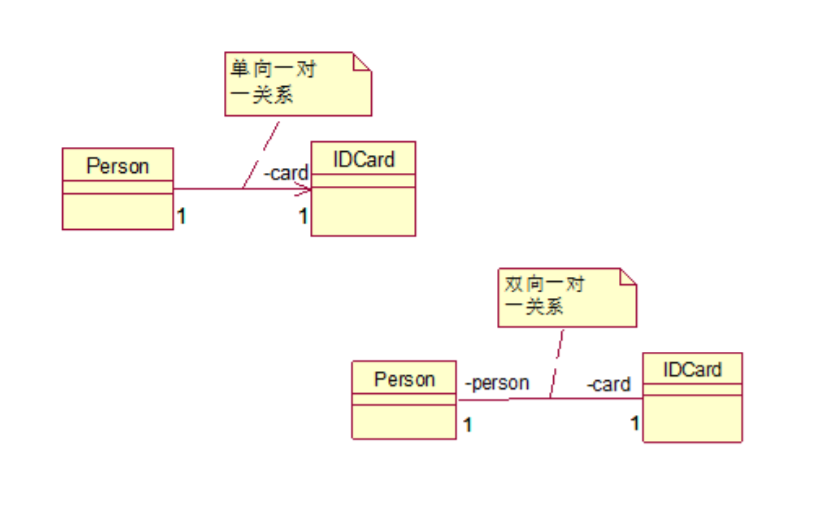

# 关联关系

关联关系实际上就是类与类之间的联系，他是依赖关系的特例  
关联具有导航性：即双向关系或单向关系  
关系具有多重性：如“1”（表示有且仅有一个），“0...”（表示0个或者多个）， “0，1”（表示0个或者一个），“n...m”(表示n到m个都可以)，“m...*”（表示至少m个）

单向一对一关系

```
public class Person {
    private IDCard card;
}
public class IDCard{}
```

双向一对一关系

```
public class Person {
    private IDCard card;
}
public class IDCard{
    private Person person;
}
```



## [实例](../association)