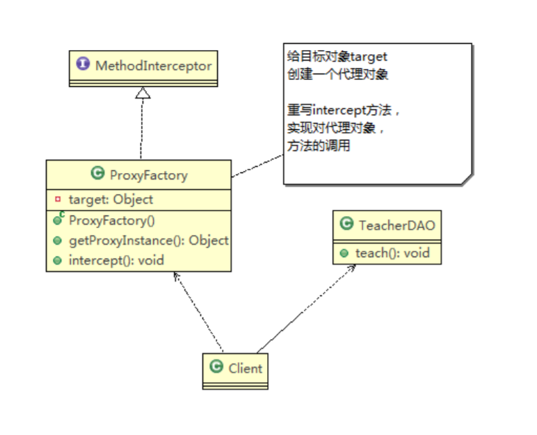

# UML

## 基本介绍

1) UML——Unified modeling language，统一建模语言，是一种用于软件系统分析和设计的语言工具，它用于帮助软件开发人员进行思考和记录思路的结果
2) UML本身是一套符号的规定，就像数学符号和化学符号一样，这些符号用于描述软件模型中的各个元素和他们之间的关系，比如类、接口、实现、泛化、依赖、组合、聚合等，如下图:  
   
3) 使用UML来建模，常用的工具有 Rational Rose，也可以使用一些插件来建模

## UML图

画UML图与写文章差不多，都是把自己的思想描述给别人看，关键在于思路和条理，UML图分类：

1) 用例图(use case)
2) 静态结构图：类图、对象图、包图、组件图、部署图
3) 动态行为图：交互图（时序图与协作图）、状态图、活动图

类图是描述类与类之间的关系的，是UML图中最核心的图
